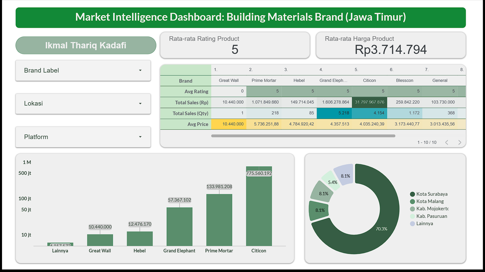

# Market Intelligence Analytics Dashboard
**Market Intelligence of Lightweight Concrete (Bata Ringan) in East Java**

## Ringkasan Eksekutif (Problem Statement)
*Bagaimana kita dapat secara objektif mengukur pangsa pasar digital, strategi harga kompetitor, dan sebaran geografis dari material konstruksi berat di era e-commerce?*

Proyek ini dibangun untuk menjawab *blind spot* pada distribusi retail bahan bangunan. Dengan mengekstraksi data secara terstruktur dari platform marketplace dan retail modern, sistem ini memetakan persaingan produk **Bata Ringan** (Citicon, Blesscon, Grand Elephant, dll) secara langsung berdasarkan angka penjualan dan omzet riil pedagang grosir di Jawa Timur.

## Tahapan Proyek
1. **Data Acquisition (Scraping):** Menggunakan custom Selenium automation script yang tahan terhadap bot-blocker modern. Sistem menarik insight harga, lokasi, dan rating secara masif melalui Tokopedia (Toko Retail/Independen), Depo Bangunan (Modern Trade), dan Mitra 10 (Modern Trade).
2. **Data Cleansing & Structuring:** Mengkonversi data web mentah menggunakan Python Pandas. Mengubah angka terselubung teks ke *Integer/Numeric Price, Sold Count*, memilah metrik tersembunyi, serta mapping wilayah penalti Jawa Timur.
3. **Data Analysis & Intelligence (Pivot):** Analisis silang metrik utama (Market Share, Price Gap Analysis, dan Profiling Store Geographic).
4. **Data Visualization:** Ekspansi agregat ke visualisasi interaktif pada Business Intelligence Dashboard (Looker).

---

## 📊 Hasil Analisis Market & Insight

Berikut adalah konklusi taktis berdasarkan pengolahan data volume pasar. 

1. **Dominasi Nilai Beredar (Citicon)**  
   Citicon memegang kendali ekstrim dengan persentase perputaran uang *Share Value* sebesar **90,66%**. Menariknya, pusat omzet berada di wilayah inti Surabaya (lebih dari Rp 31 Miliar). Ini membuktikan bahwa pembeli Citicon di digital masuk pada transaksi paket raksasa / proyek, mengukuhkan posisinya sebagai **Premium Leader**.
   
2. **"The Volume Chaser" (Grand Elephant)**  
   Meski secara kuantitas terjual mencetak angka dominan (Share Volume **46,19%**), ironisnya kontribusi omzet uangnya sangat kerdil (4,58%). Hal ini membongkar fakta strategi harga bawah (*low-price/economy*) dimana barang laku di platform hanya berbentuk eceran / pesanan unit kecil.

3. **Senjata Tersembunyi (Blesscon)**  
   Berada di posisi **Potential Challenger** yang berbahaya. Blesscon nyatanya menyikat habis perihal *Consumer Trust* dengan nilai kepuasan tertingi **(Rating 4.99)**—mengalahkan kompetitor utamanya. Ditambahkan selisih harga (Price Gap) pasar **22% lebih murah** dari Citicon. Distribusi Blesscon sangat kuat tertanam kokoh di *Ring-2* manufaktur (Mojokerto dan Pasuruan).

4. **Paradoks Distribusi (Falcon)**  
   Data menunjukkan Falcon melakukan *"tebar jaring"*. Falcon memiliki sebaran penjual paling rakus (41 toko aktif), namun volumenya lenyap di angka (0,53%). Indikasi mengerikan dari **Over-distribution**, di mana barang tersedia di seluruh rantai supply toko, namun tidak terjadi tarikan *demand* di masyarakat.

---

## Rekomendasi Strategis Eksekutif
- **Penetrasi Konsumen Citicon:** Gunakan *Unique Selling Proposition (USP)* skor rating konsumen 4.99 sebagai basis *trust* untuk merebut calon pembeli Citicon di Surabaya dengan penawaran *Value for Money* (diskon margin 22%).
- **Audit Distribusi:** Pangkas / konsolidasi *low-turnover stores* dan alokasikan budget *trade-promo* untuk difokuskan pada segelintir *high-turnover stores* berkecepatan tinggi, jangan mengekor strategi bumerang Falcon.

---

## 🔗 Live Analytics Dashboard
Seluruh visualisasi dinamis, persebaran peta interaktif, dan tracking fluktuasi harga Bata Ringan se-Jawa Timur dapat dieksplorasi secara *Live* pada tautan Business Intelligence Looker Studio berikut:

👉 **[Launch Executive Dashboard - Looker Studio](https://lookerstudio.google.com/reporting/cf78e1f3-bf3c-4e4a-8014-431541930ca7)**
